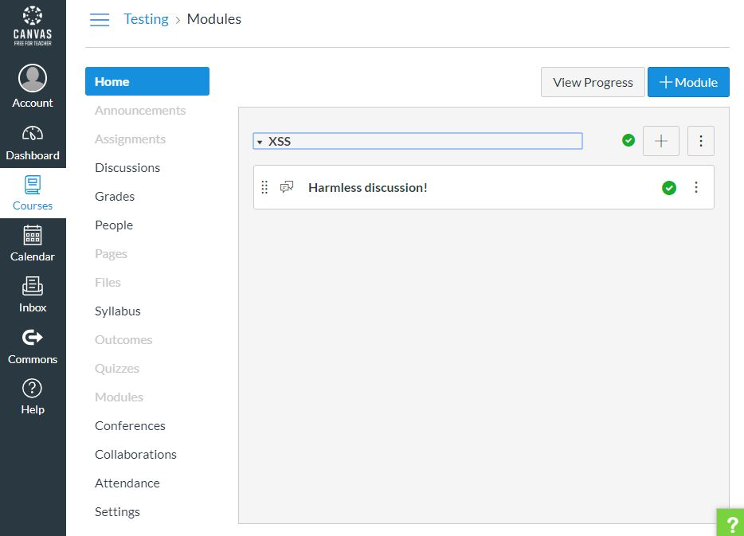
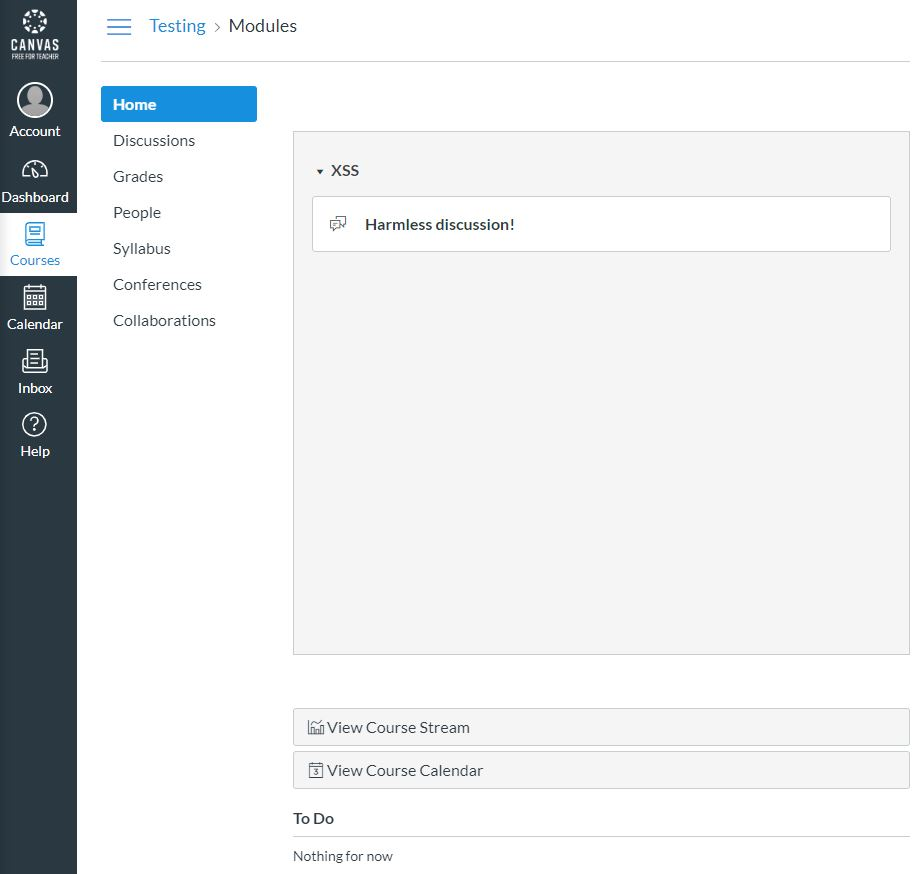
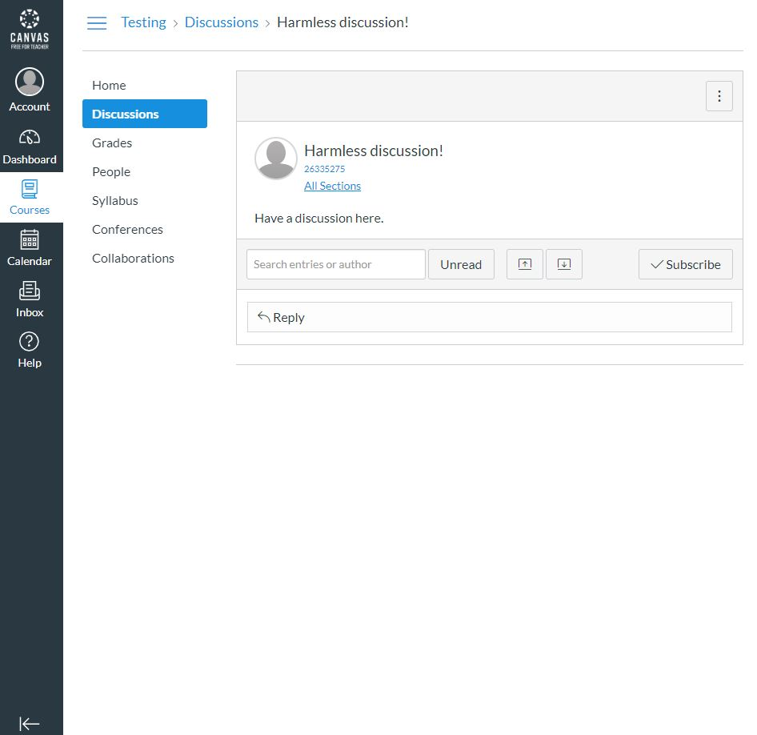
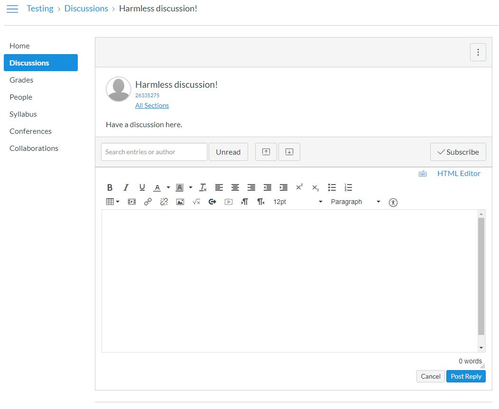
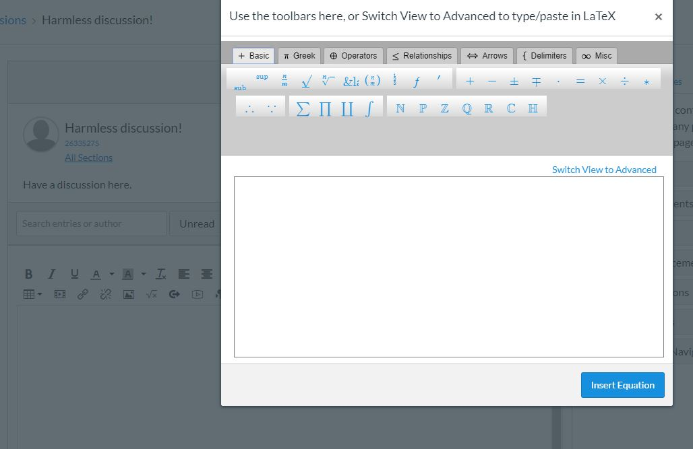
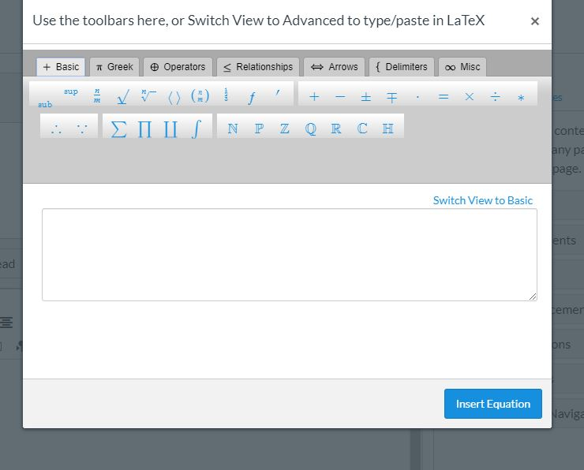
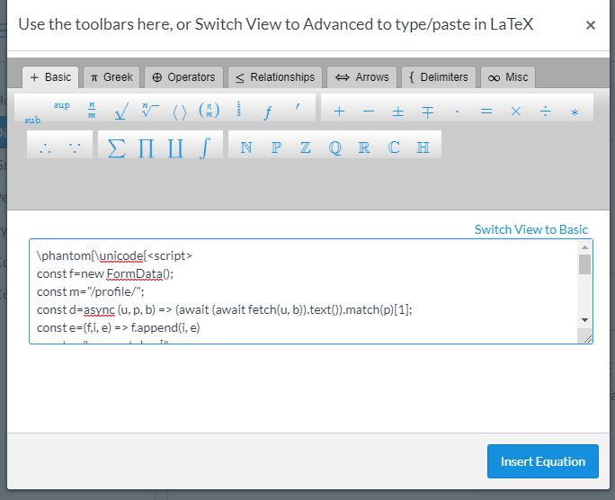
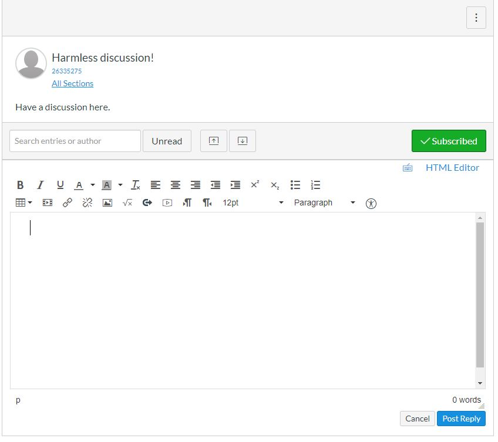
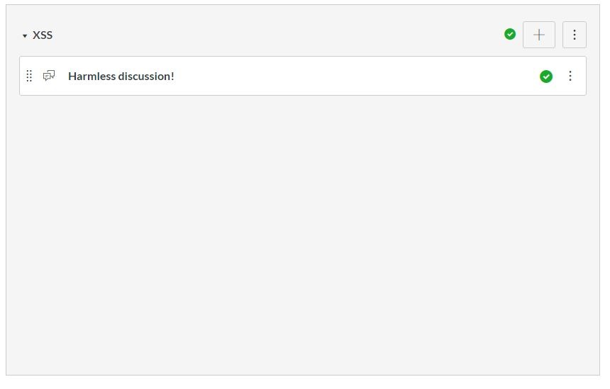
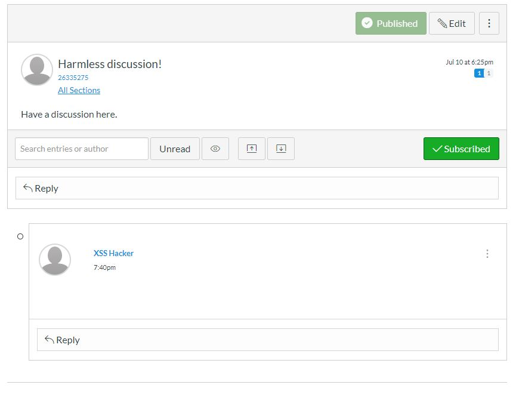

[Link to Repo](https://github.com/Sesamestrong/example-canvas-xss-attack)
# Example XSS (Cross Site Scripting) Attack on Instructure's Canvas LMS
## The Vulnerability
The XSS Vulnerability, detailed at [CVE-2018-1999024](https://www.cvedetails.com/cve/CVE-2018-1999024/), is due to an outdated version of MathJax with [a vulnerability in the \unicode{} macro](https://blog.bentkowski.info/2018/06/xss-in-google-colaboratory-csp-bypass.html). It allows any malicious user to insert JavaScript into a Rich Text comment using the Rich Text editor; the user simply puts JavaScript into a \unicode{} tag and posts it. The wrapper to write a hiddent XSS script is as follows:
```
\phantom{
    \unicode{
        <script>
            //Arbitrary JavaScript code
        </script>
    }
}
```
In this example, the \phantom{} tag is used to hide the unicode character and not arouse suspicion of an attack.
On Canvas LMS, XSS can be used to retreive an Access Token with which a **malicious user gains complete control of a victim's account indefinitely**.
## This Attack
The malicious server here logs a victim's developer key and deletes all their courses. However, once the attack is done, the owner of the server could do anything with the victim's account at any time, such as changing grades or serving this XSS to students. This attack highlights only a fraction of the total possible damage of the attack; in a worst-case scenario, one attacker could use victims to serve the same XSS to their peers and teachers, resulting in the attacker having widespread, undetected and infinite control of hundreds to thousands of accounts in a Canvas LMS system.
The steps of this attack specifically are as follows:
1. Victim (in this case, teacher) creates a discussion, journal or other type of assignment using the rich text editor. In this example, it is a discussion.

  

2. Attacker's account:

  

3. Attacker opens the discussion.

  

4. Attacker clicks "Reply".

  

5. Attacker clicks the "Insert Math Equation" button.

  

6. Attacker clicks the "Switch View to Advanced" link.

  

7. Attacker inserts the malicious JavaScript code in the following format: `\phantom{\unicode{<script>/*JavaScript goes here*/</script>}}`
  * The malicious code is documented in [example.txt](example.txt).

  
  
8. Attacker clicks "Insert Equation".

  

9. Attacker clicks "Reply".

  

11. Victim's account:

  

10. Victim opens the discussion.

  

At this point, no more interaction is necessary between the attacker and the victim; the JavaScript code automatically sends an Access Token controlling the victim's account to the attacker's server.
The server then logs the Access Token and uses the Canvas LMS API to do the following:
1. List the Course ID of every course the victim owns.
2. Delete every course that the victim owns via Course ID.
Once this action is finished, a Canvas Admin can restore the course, but all user data is lost permanently. This includes the malicious code that the attacker injected.


The result of this attack is an untraceable, devastating attack that doe irreparable damage to a school or teacher's course. All student data is lost. The effects of even this, a relatively tame attack, would be brutal, especially in a situation such as a university course (many universities use Canvas LMS); every assignment or grade in the affected professor's class would be lost forever.
## How to solve this
I propose two solutions:
1. A fix to the outdated MathJax version that allowed for XSS in the first place. This is already included in a pull request to instructure/canvas-lms.
2. A requirement for users to login with both username and password in order to obtain a developer key; this way, any potential XSS discovered in the future could not be used to gain indefinite access to a victim's account. This is included as an issue in instructure/canvas-lms.
## Existing attacks
As are all zero-day vulnerabilities, this type of attack may have been exploited already. The result could reach from control of one teacher's account to a full-fledged, virus-like "botnet" of sorts (in the sense that an attacker could both control all critical functions of every affected account). Although most competent attackers would likely have deleted courses in which they have infected others, covering up their crimes, they could have left behind a network of compromised accounts. A network such as this could possibly be used actively by an attacker to infect more devices for further control.
The best way to address past exploits is to first implement the above solutions to the vulnerability, then to give a warning to all administrators using Canvas LMS and to disable all user-generated Access Tokens.
## Cause of the vulnerability
The vulnerability in MathJax was not highlighted on the instructure/canvas-lms repository because MathJax was not imported using a package manager or the like, but rather [a JQuery HTTP request](https://github.com/instructure/canvas-lms/blob/master/public/javascripts/mathml.js#L28):
```javascript
//public/javascripts/mathml.js
export function loadMathJax (configFile, cb = null) {
  if (!isMathJaxLoaded()) {
    // signal local config to mathjax as it loads
    window.MathJax = localConfig;
    $.getScript(`//cdnjs.cloudflare.com/ajax/libs/mathjax/2.7.1/MathJax.js?config=${configFile}`, cb);
  } else if (typeof cb === 'function') {
      // Make sure we always call the callback if it is loaded already and make sure we
      // also reprocess the page since chances are if we are requesting MathJax again,
      // something has changed on the page and needs to get pulled into the MathJax ecosystem
      window.MathJax.Hub.Reprocess();
      cb();
  }
}
```
I recommend using a dedicated package like NPM, for which GitHub Dependabot, GitHub security warnings or other, similar auto-patching dependency managers could be used to ensure security via up-to-date packages in the future.